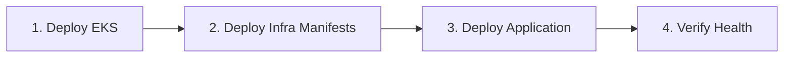
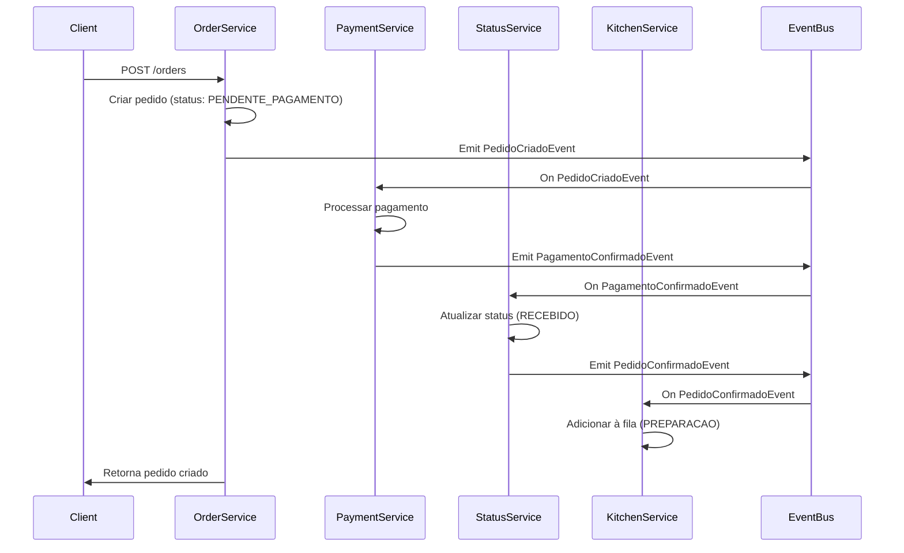
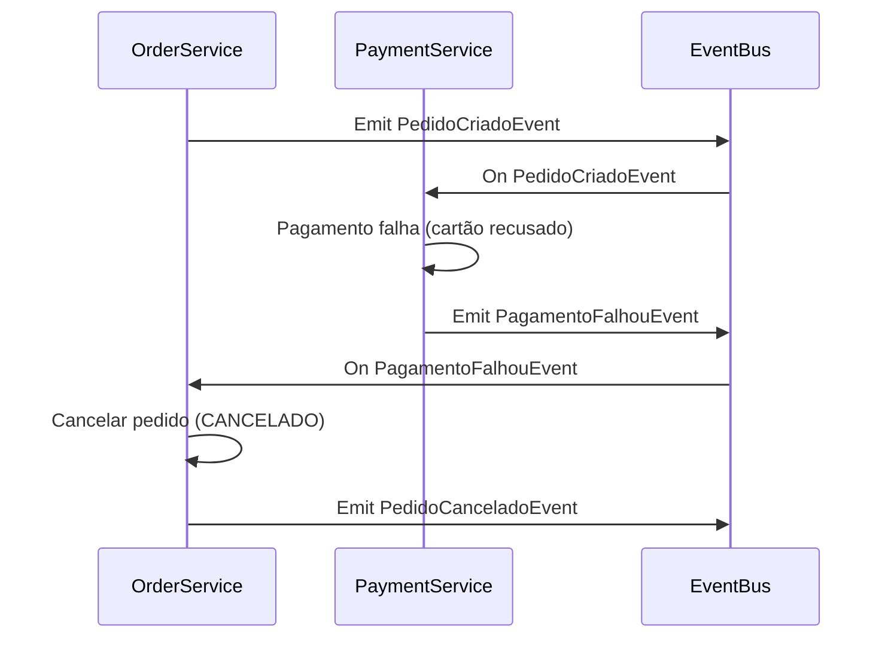

# 🚀 PROMPT PARA IMPLEMENTAR MELHORIAS - Tech Challenge FIAP

> **Copie e cole este prompt para o Copilot implementar as correções prioritárias**

---

## 📋 CONTEXTO

Estou trabalhando no **Tech Challenge da FIAP - Fase 3** e preciso ajustar o repositório `fiap-soat-k8s-terraform` para atender todos os requisitos do projeto. O repositório contém a infraestrutura Kubernetes (EKS) e manifests, mas identificamos **13 problemas críticos/altos** que precisam ser corrigidos.

**Objetivo**: Implementar as correções de forma organizada, mantendo o histórico Git limpo e seguindo boas práticas.

---

## 🎯 TAREFAS PRIORITÁRIAS (Ordem de Execução)

### **TAREFA 1: Padronizar Nomenclatura dos Manifests** 🔴 CRÍTICO

**Problema**: Todos os manifests usam `fiap-soat-nestjs` mas o repositório da aplicação espera `fiap-soat-application`.

**Ação**:
1. Atualizar arquivos:
   - `manifests/deployment.yaml`: 
     - `metadata.name: fiap-soat-application`
     - `metadata.labels.app: fiap-soat-application`
     - `spec.selector.matchLabels.app: fiap-soat-application`
     - `spec.template.metadata.labels.app: fiap-soat-application`
   
   - `manifests/service.yaml`:
     - `metadata.name: fiap-soat-application-service`
     - `metadata.labels.app: fiap-soat-application`
     - `spec.selector.app: fiap-soat-application`
   
   - `manifests/configmap.yaml`:
     - `metadata.name: fiap-soat-application-config`
   
   - `manifests/secret.yaml`:
     - `metadata.name: fiap-soat-application-secrets`

2. Atualizar referências em `.github/workflows/deploy-app.yml`:
   - Trocar todas as ocorrências de `fiap-soat-nestjs` por `fiap-soat-application`

3. Atualizar README.md:
   - Trocar todas as referências de `fiap-soat-nestjs` por `fiap-soat-application`

**Commit Message**:
```
fix: padronizar nomes de recursos Kubernetes para fiap-soat-application

- Atualiza deployment, service, configmap, secret
- Alinha com nomenclatura do repositório da aplicação
- Corrige inconsistência entre workflows EKS e Application
```

---

### **TAREFA 2: Separar Responsabilidades CI/CD** 🔴 CRÍTICO

**Problema**: Workflow EKS aplica `deployment.yaml`, mas o repositório da aplicação também gerencia o deployment (conflito).

**Estratégia**: 
- **Workflow EKS**: Gerencia infraestrutura base (namespace, configmap, secret, service)
- **Workflow Application**: Gerencia deployment (imagem dinâmica, versionamento)

**Ação**:
1. Editar `.github/workflows/deploy-app.yml`:

```yaml
- name: Deploy Infrastructure Manifests
  run: |
    kubectl apply -f manifests/namespace.yaml
    kubectl apply -f manifests/configmap.yaml
    kubectl apply -f manifests/secret.yaml
    kubectl apply -f manifests/service.yaml
    
    echo "✅ Infrastructure manifests deployed"
    echo "ℹ️ Deployment is managed by the Application repository CI/CD"

- name: Verify Service
  run: |
    kubectl get service -n fiap-soat-app fiap-soat-application-service
    kubectl get endpoints -n fiap-soat-app fiap-soat-application-service

# REMOVER: Seção de rollout status do deployment
# O deployment é gerenciado pelo repo da aplicação
```

2. Atualizar README.md - Adicionar seção "🔄 Estratégia CI/CD":

```markdown
## 🔄 Estratégia CI/CD

Este projeto utiliza **dois pipelines separados**:

### 1. **Pipeline EKS (este repositório)**
- Provisiona infraestrutura (VPC, EKS, Node Group)
- Aplica manifests de infraestrutura:
  - `namespace.yaml` - Namespace isolado
  - `configmap.yaml` - Configurações da aplicação
  - `secret.yaml` - Credenciais de banco
  - `service.yaml` - Service + Load Balancer

**Workflow**: `.github/workflows/deploy-app.yml`  
**Trigger**: Push na branch `main` ou manual

### 2. **Pipeline Application** ([repositório](https://github.com/3-fase-fiap-soat-team/fiap-soat-application))
- Build da imagem Docker
- Push para AWS ECR
- Atualiza deployment Kubernetes com nova imagem
- Verifica rollout do deployment

**Workflow**: `.github/workflows/ci-cd-eks.yml`  
**Trigger**: Push na branch `main` ou tags

### Por que separar?

| Aspecto | Motivo |
|---------|--------|
| **Responsabilidade** | Infra vs. Código |
| **Frequência de Deploy** | Infra rara, App frequente |
| **Controle de Versão** | Tag da imagem gerenciada pela aplicação |
| **Rollback** | Rollback de app não afeta infra |

### Sequência de Deploy Completo


```

3. Criar novo arquivo `docs/CI-CD-SEPARATION.md`:

```markdown
# 🔄 Separação de Responsabilidades CI/CD

## Problema Resolvido

Anteriormente, **ambos** os workflows (EKS e Application) aplicavam `deployment.yaml`:

- **Workflow EKS**: `kubectl apply -f deployment.yaml` (imagem `:latest`)
- **Workflow Application**: `kubectl set image deployment/... :abc123` (imagem versionada)

**Resultado**: Workflows sobrescreviam um ao outro, causando deploys inconsistentes.

## Solução Implementada

### Workflow EKS (fiap-soat-k8s-terraform)
```yaml
# Aplica APENAS infraestrutura
kubectl apply -f namespace.yaml
kubectl apply -f configmap.yaml
kubectl apply -f secret.yaml
kubectl apply -f service.yaml
```

### Workflow Application (fiap-soat-application)
```yaml
# Gerencia APENAS deployment
kubectl apply -f k8s/deployment.yaml  # Com imagem versionada
kubectl set image deployment/fiap-soat-application app=...
kubectl rollout status deployment/fiap-soat-application
```

## Manifests por Responsabilidade

| Manifest | Gerenciado Por | Motivo |
|----------|----------------|--------|
| `namespace.yaml` | EKS | Infraestrutura base |
| `configmap.yaml` | EKS | Configurações de ambiente |
| `secret.yaml` | EKS | Credenciais (deve migrar para Secrets Manager) |
| `service.yaml` | EKS | Load Balancer (raramente muda) |
| `deployment.yaml` | **Application** | Imagem muda a cada deploy de código |

## Fluxo de Deploy Completo

1. **Deploy Inicial (EKS)**:
   ```bash
   # Provisiona cluster + infraestrutura
   terraform apply
   kubectl apply -f namespace.yaml
   kubectl apply -f configmap.yaml
   kubectl apply -f secret.yaml
   kubectl apply -f service.yaml
   ```

2. **Primeiro Deploy da Aplicação**:
   ```bash
   # Cria deployment com imagem inicial
   kubectl apply -f k8s/deployment.yaml
   ```

3. **Deploys Subsequentes (Application)**:
   ```bash
   # Atualiza APENAS imagem do deployment
   kubectl set image deployment/fiap-soat-application \\
     app=123456789012.dkr.ecr.us-east-1.amazonaws.com/fiap-soat-app:abc123
   kubectl rollout status deployment/fiap-soat-application
   ```

## Vantagens

✅ **Sem Conflitos**: Cada workflow gerencia recursos distintos  
✅ **Versionamento**: Imagem da aplicação sempre com hash do commit  
✅ **Rollback Simples**: `kubectl rollout undo deployment/fiap-soat-application`  
✅ **Deploy Independente**: Atualizar app sem reapply de toda infra  
✅ **Auditoria**: Git history mostra claramente mudanças de infra vs. app

## Troubleshooting

### Problema: Service sem Endpoints
```bash
kubectl get endpoints -n fiap-soat-app
# NAME                           ENDPOINTS   AGE
# fiap-soat-application-service  <none>      10m
```

**Causa**: Deployment ainda não criado (app não deployada)  
**Solução**: Aguardar primeiro deploy da aplicação

### Problema: Imagem Antiga Após Deploy
```bash
kubectl describe pod -n fiap-soat-app | grep Image:
# Image: ...ecr.../fiap-soat-app:latest  ← Deveria ser :abc123
```

**Causa**: Workflow EKS foi executado após workflow Application  
**Solução**: Reexecutar workflow da aplicação
```

**Commit Message**:
```
refactor: separar responsabilidades entre workflows EKS e Application

- Workflow EKS gerencia: namespace, configmap, secret, service
- Workflow Application gerencia: deployment (imagem versionada)
- Remove conflito de sobrescrita de deployment.yaml
- Adiciona documentação de estratégia CI/CD
```

---

### **TAREFA 3: Remover Secrets Hardcoded (Segurança)** 🟠 ALTA

**Problema**: `secret.yaml` contém credenciais em base64 no Git (risco de segurança).

**Ação**:
1. Remover `manifests/secret.yaml` do Git:
   ```bash
   git rm manifests/secret.yaml
   ```

2. Adicionar `manifests/secret.yaml` no `.gitignore`:
   ```
   # Secrets (gerenciados via GitHub Actions)
   manifests/secret.yaml
   ```

3. Criar `manifests/secret.example.yaml`:
   ```yaml
   apiVersion: v1
   kind: Secret
   metadata:
     name: fiap-soat-application-secrets
     namespace: fiap-soat-app
   type: Opaque
   data:
     # ATENÇÃO: Não commitar este arquivo com valores reais!
     # Use GitHub Secrets + kubectl create secret
     DATABASE_PASSWORD: "<BASE64_ENCODED_PASSWORD>"
     JWT_SECRET: "<BASE64_ENCODED_JWT_SECRET>"
   ```

4. Atualizar `.github/workflows/deploy-app.yml` para criar secret dinamicamente:
   ```yaml
   - name: Create Kubernetes Secret
     run: |
       kubectl create secret generic fiap-soat-application-secrets \
         --namespace=fiap-soat-app \
         --from-literal=DATABASE_PASSWORD=${{ secrets.DB_PASSWORD }} \
         --from-literal=JWT_SECRET=${{ secrets.JWT_SECRET }} \
         --dry-run=client -o yaml | kubectl apply -f -
       
       echo "✅ Secrets created/updated from GitHub Secrets"
   ```

5. Atualizar README.md - Adicionar seção "🔐 Configuração de Secrets":
   ```markdown
   ## 🔐 Configuração de Secrets
   
   ### Secrets Necessários (GitHub Repository)
   
   Configure em: `Settings > Secrets and variables > Actions`
   
   | Nome | Descrição | Exemplo |
   |------|-----------|---------|
   | `DB_PASSWORD` | Senha do RDS PostgreSQL | `SuperSecret123!` |
   | `JWT_SECRET` | Secret para assinar JWT | `my-super-secret-key-256-bits` |
   | `AWS_ACCESS_KEY_ID` | Credenciais AWS Academy | (renovar a cada 4h) |
   | `AWS_SECRET_ACCESS_KEY` | Credenciais AWS Academy | (renovar a cada 4h) |
   | `AWS_SESSION_TOKEN` | Token de sessão AWS | (renovar a cada 4h) |
   
   ### Deploy Manual de Secrets
   
   Se precisar criar secrets manualmente:
   
   ```bash
   # 1. Criar secret
   kubectl create secret generic fiap-soat-application-secrets \
     --namespace=fiap-soat-app \
     --from-literal=DATABASE_PASSWORD='SuperSecret123!' \
     --from-literal=JWT_SECRET='my-super-secret-key-256-bits'
   
   # 2. Verificar (dados ficam ocultos)
   kubectl get secret -n fiap-soat-app fiap-soat-application-secrets
   
   # 3. Ver conteúdo (para debug)
   kubectl get secret -n fiap-soat-app fiap-soat-application-secrets -o jsonpath='{.data.DATABASE_PASSWORD}' | base64 -d
   ```
   
   ### ⚠️ IMPORTANTE: Renovação de Credenciais AWS Academy
   
   As credenciais AWS Academy **expiram a cada 4 horas**. Para renovar:
   
   ```bash
   # 1. Pegar novas credenciais no AWS Academy
   # 2. Atualizar GitHub Secrets
   # 3. OU usar script local
   ./scripts/aws-config.sh
   ```
   ```

6. Criar `docs/SECRETS-MANAGEMENT.md`:
   ```markdown
   # 🔐 Gerenciamento de Secrets
   
   ## Estratégia de Segurança
   
   ### ❌ O que NÃO fazer
   - Commitar secrets em arquivos YAML
   - Usar base64 como "criptografia" (é apenas encoding!)
   - Compartilhar secrets via Slack/Email
   
   ### ✅ O que fazer
   - Usar **GitHub Secrets** para CI/CD
   - Criar secrets via `kubectl create secret` (nunca `kubectl apply -f`)
   - Rotacionar secrets periodicamente
   - Usar AWS Secrets Manager em produção (futuro)
   
   ## Implementação Atual
   
   ### 1. GitHub Secrets (CI/CD)
   ```yaml
   # .github/workflows/deploy-app.yml
   - name: Create Secret
     run: |
       kubectl create secret generic fiap-soat-application-secrets \
         --from-literal=DATABASE_PASSWORD=${{ secrets.DB_PASSWORD }} \
         --dry-run=client -o yaml | kubectl apply -f -
   ```
   
   ### 2. Manual (Deploy Local)
   ```bash
   kubectl create secret generic fiap-soat-application-secrets \
     --namespace=fiap-soat-app \
     --from-literal=DATABASE_PASSWORD='SuperSecret123!' \
     --from-literal=JWT_SECRET='my-jwt-secret'
   ```
   
   ## Melhorias Futuras (Fase 4)
   
   ### AWS Secrets Manager + External Secrets Operator
   
   ```yaml
   # k8s/external-secret.yaml
   apiVersion: external-secrets.io/v1beta1
   kind: ExternalSecret
   metadata:
     name: fiap-soat-db-credentials
   spec:
     secretStoreRef:
       name: aws-secrets-manager
     target:
       name: fiap-soat-application-secrets
     data:
       - secretKey: DATABASE_PASSWORD
         remoteRef:
           key: prod/fiap-soat/db-password
   ```
   
   **Vantagens**:
   - Rotação automática de secrets
   - Auditoria centralizada (CloudTrail)
   - Criptografia com AWS KMS
   - Sem secrets no Git ou GitHub Actions
   
   ## Troubleshooting
   
   ### Secret não encontrado
   ```bash
   kubectl get secret -n fiap-soat-app
   # Error: secrets "fiap-soat-application-secrets" not found
   ```
   **Solução**: Reexecutar workflow ou criar manualmente
   
   ### App não consegue ler secret
   ```bash
   kubectl logs -n fiap-soat-app deployment/fiap-soat-application
   # Error: DATABASE_PASSWORD environment variable is not set
   ```
   **Solução**: Verificar se deployment.yaml referencia o secret:
   ```yaml
   env:
     - name: DATABASE_PASSWORD
       valueFrom:
         secretKeyRef:
           name: fiap-soat-application-secrets
           key: DATABASE_PASSWORD
   ```
   ```

**Commit Message**:
```
security: remover secrets hardcoded e migrar para GitHub Secrets

- Remove manifests/secret.yaml do Git (risco de segurança)
- Adiciona secret.example.yaml como template
- Workflow cria secrets dinamicamente via GitHub Secrets
- Adiciona documentação de gerenciamento de secrets
- BREAKING: Requer configuração de DB_PASSWORD e JWT_SECRET no GitHub
```

---

### **TAREFA 4: Adicionar Health Checks ao Deployment** 🟡 MÉDIA

**Problema**: Deployment não tem liveness/readiness probes (Kubernetes não sabe se pod está saudável).

**Ação**:
1. Editar `manifests/deployment.yaml`:

```yaml
spec:
  template:
    spec:
      containers:
      - name: app
        image: 123456789012.dkr.ecr.us-east-1.amazonaws.com/fiap-soat-app:latest
        ports:
        - containerPort: 3000
        
        # ADICIONAR: Health checks
        livenessProbe:
          httpGet:
            path: /health
            port: 3000
            scheme: HTTP
          initialDelaySeconds: 30
          periodSeconds: 10
          timeoutSeconds: 5
          failureThreshold: 3
          successThreshold: 1
        
        readinessProbe:
          httpGet:
            path: /health
            port: 3000
            scheme: HTTP
          initialDelaySeconds: 10
          periodSeconds: 5
          timeoutSeconds: 3
          failureThreshold: 3
          successThreshold: 1
        
        resources:
          requests:
            memory: "256Mi"    # Era 128Mi - aumentado
            cpu: "100m"        # Era 50m - aumentado
          limits:
            memory: "512Mi"    # Era 256Mi - aumentado
            cpu: "500m"        # Era 200m - aumentado
```

2. Atualizar README.md - Adicionar seção "🏥 Health Checks":
```markdown
## 🏥 Health Checks

A aplicação expõe endpoints de saúde para o Kubernetes monitorar:

### Liveness Probe
- **Path**: `/health`
- **Propósito**: Detectar se o pod está travado/morto
- **Ação**: Kubernetes reinicia o pod se falhar 3x

### Readiness Probe
- **Path**: `/health`
- **Propósito**: Detectar se o pod está pronto para receber tráfego
- **Ação**: Remove pod do Service se falhar 3x

### Testar Manualmente
```bash
# Via Load Balancer
curl http://<LOAD_BALANCER>/health

# Via Port-Forward
kubectl port-forward -n fiap-soat-app deployment/fiap-soat-application 3000:3000
curl http://localhost:3000/health
```

**Resposta esperada**:
```json
{
  "status": "ok",
  "info": {
    "database": { "status": "up" },
    "memory": { "status": "up" }
  }
}
```
```

**Commit Message**:
```
feat: adicionar health checks e aumentar resource limits

- Adiciona livenessProbe e readinessProbe no deployment
- Aumenta resource requests/limits (prevenção de OOMKilled)
- Documenta health checks no README
```

---

### **TAREFA 5: Adicionar HPA (Horizontal Pod Autoscaler)** 🟡 MÉDIA

**Problema**: Aplicação tem apenas 1 réplica fixa (sem escalabilidade horizontal).

**Ação**:
1. Criar `manifests/hpa.yaml`:

```yaml
apiVersion: autoscaling/v2
kind: HorizontalPodAutoscaler
metadata:
  name: fiap-soat-application-hpa
  namespace: fiap-soat-app
spec:
  scaleTargetRef:
    apiVersion: apps/v1
    kind: Deployment
    name: fiap-soat-application
  minReplicas: 1
  maxReplicas: 3
  metrics:
  - type: Resource
    resource:
      name: cpu
      target:
        type: Utilization
        averageUtilization: 70
  - type: Resource
    resource:
      name: memory
      target:
        type: Utilization
        averageUtilization: 80
  behavior:
    scaleDown:
      stabilizationWindowSeconds: 300
      policies:
      - type: Percent
        value: 50
        periodSeconds: 15
    scaleUp:
      stabilizationWindowSeconds: 0
      policies:
      - type: Percent
        value: 100
        periodSeconds: 15
      - type: Pods
        value: 2
        periodSeconds: 15
      selectPolicy: Max
```

2. Atualizar `.github/workflows/deploy-app.yml`:
```yaml
- name: Deploy Infrastructure Manifests
  run: |
    kubectl apply -f manifests/namespace.yaml
    kubectl apply -f manifests/configmap.yaml
    kubectl apply -f manifests/service.yaml
    kubectl apply -f manifests/hpa.yaml    # ADICIONAR
```

3. Atualizar `manifests/deployment.yaml` (remover replicas fixas):
```yaml
spec:
  # replicas: 1  ← REMOVER (HPA controla)
  selector:
    matchLabels:
      app: fiap-soat-application
```

4. Atualizar README.md - Adicionar seção "📈 Escalabilidade":
```markdown
## 📈 Escalabilidade (HPA)

### Configuração Atual
- **Min Replicas**: 1 pod
- **Max Replicas**: 3 pods
- **Trigger CPU**: >70% por 15s → escala +100% ou +2 pods
- **Trigger Memory**: >80% por 15s → escala +100% ou +2 pods
- **Scale Down**: Espera 5min de estabilidade, reduz 50% por vez

### Monitorar HPA
```bash
# Ver status do autoscaler
kubectl get hpa -n fiap-soat-app

# Output esperado:
# NAME                        REFERENCE                         TARGETS                MINPODS   MAXPODS   REPLICAS
# fiap-soat-application-hpa   Deployment/fiap-soat-application   15%/70%, 20%/80%       1         3         1

# Acompanhar em tempo real
kubectl get hpa -n fiap-soat-app -w
```

### Testar Autoscaling
```bash
# 1. Gerar carga
cd load-tests
./run-all-tests.sh

# 2. Monitorar pods escalando
kubectl get pods -n fiap-soat-app -w

# 3. Ver eventos de scaling
kubectl describe hpa -n fiap-soat-app fiap-soat-application-hpa
```

### Custos de Autoscaling
| Cenário | Pods | vCPU | Memória | Custo/mês |
|---------|------|------|---------|-----------|
| Idle (noite) | 1 | 0.5 | 512MB | ~$5 |
| Carga média | 2 | 1.0 | 1GB | ~$10 |
| Pico (testes) | 3 | 1.5 | 1.5GB | ~$15 |

**Nota**: Custos baseados em nodes t3.micro (Free Tier)
```

**Commit Message**:
```
feat: adicionar autoscaling horizontal (HPA)

- Cria HPA com min=1, max=3 replicas
- Escala baseado em CPU (70%) e Memory (80%)
- Remove replicas fixas do deployment
- Documenta monitoramento e testes de carga
```

---

### **TAREFA 6: Melhorar Documentação (Guia de Testes)** 🟡 MÉDIA

**Problema**: README não mostra como testar a aplicação.

**Ação**:
1. Atualizar README.md - Adicionar seção "🧪 Como Testar":

```markdown
## 🧪 Como Testar o Sistema

### 1️⃣ Verificar Infraestrutura

```bash
# Cluster EKS
kubectl cluster-info

# Nodes disponíveis
kubectl get nodes

# Pods rodando
kubectl get pods -n fiap-soat-app

# Services e Load Balancer
kubectl get service -n fiap-soat-app
```

### 2️⃣ Health Check da Aplicação

```bash
# Pegar URL do Load Balancer
export LB_URL=$(kubectl get service -n fiap-soat-app fiap-soat-application-service \
  -o jsonpath='{.status.loadBalancer.ingress[0].hostname}')

# Testar health
curl http://$LB_URL/health
```

**Resposta esperada**:
```json
{
  "status": "ok",
  "info": {
    "database": { "status": "up" },
    "memory": { "status": "up" }
  }
}
```

### 3️⃣ Swagger UI (Documentação Interativa)

```bash
# Abrir no navegador
echo "http://$LB_URL/docs"
```

### 4️⃣ Fluxo Completo de Pedido

#### A. Cadastrar Cliente (via Lambda /signup)

```bash
# 1. Pegar URL do API Gateway (output do Terraform do repo lambda)
export API_URL="https://xxxxxxxxx.execute-api.us-east-1.amazonaws.com/dev"

# 2. Cadastrar cliente
curl -X POST $API_URL/signup \
  -H "Content-Type: application/json" \
  -d '{
    "cpf": "12345678900",
    "name": "João Silva",
    "email": "joao@example.com"
  }'
```

**Resposta**:
```json
{
  "message": "User created successfully",
  "user": {
    "cpf": "12345678900",
    "name": "João Silva",
    "email": "joao@example.com"
  }
}
```

#### B. Autenticar e Obter JWT (via Lambda /auth)

```bash
# 1. Autenticar com CPF
curl -X GET $API_URL/auth/12345678900

# Salvar token JWT
export JWT_TOKEN="<copiar accessToken da resposta>"
```

**Resposta**:
```json
{
  "accessToken": "eyJhbGciOiJSUzI1NiIsInR5cCI6IkpXVCJ9...",
  "idToken": "eyJhbGciOiJSUzI1NiIsInR5cCI6IkpXVCJ9...",
  "refreshToken": "eyJjdHkiOiJKV1QiLCJlbmMiOiJBMjU2R0NNIi...",
  "expiresIn": 3600
}
```

#### C. Consultar Produtos

```bash
# Listar produtos disponíveis
curl http://$LB_URL/products
```

#### D. Criar Pedido

```bash
curl -X POST http://$LB_URL/orders \
  -H "Content-Type: application/json" \
  -H "Authorization: Bearer $JWT_TOKEN" \
  -d '{
    "customerId": "12345678900",
    "items": [
      {
        "productId": 1,
        "quantity": 2,
        "notes": "Sem cebola"
      },
      {
        "productId": 3,
        "quantity": 1
      }
    ]
  }'
```

**Resposta**:
```json
{
  "id": 1,
  "customerId": "12345678900",
  "status": "PENDENTE_PAGAMENTO",
  "total": 45.50,
  "createdAt": "2025-01-20T10:30:00Z"
}
```

#### E. Consultar Pedido

```bash
# Por ID
curl http://$LB_URL/orders/1

# Todos os pedidos
curl http://$LB_URL/orders

# Por status
curl http://$LB_URL/orders?status=PENDENTE_PAGAMENTO
```

### 5️⃣ Testes de Carga

```bash
# Rodar todos os testes
cd load-tests
./run-all-tests.sh

# OU rodar individualmente

# Artillery (HTTP load testing)
cd artillery
npm install
npm run test:basic
npm run test:spike

# K6 (Performance testing)
cd ../k6
k6 run --vus 10 --duration 30s basic-load-test.js
```

**Métricas esperadas**:
- **Latência p95**: < 500ms
- **Taxa de erro**: < 1%
- **Throughput**: > 100 req/s

### 6️⃣ Monitorar Logs

```bash
# Logs da aplicação
kubectl logs -n fiap-soat-app deployment/fiap-soat-application --tail=100 -f

# Logs de um pod específico
kubectl logs -n fiap-soat-app <POD_NAME> -f

# Eventos do namespace
kubectl get events -n fiap-soat-app --sort-by='.lastTimestamp'
```

### 7️⃣ Troubleshooting

#### Pod não está Ready
```bash
kubectl describe pod -n fiap-soat-app <POD_NAME>
kubectl logs -n fiap-soat-app <POD_NAME>
```

#### Service sem Endpoints
```bash
kubectl get endpoints -n fiap-soat-app
# Se <none>, deployment ainda não foi criado pela aplicação
```

#### Load Balancer em Pending
```bash
kubectl describe service -n fiap-soat-app fiap-soat-application-service
# Aguardar ~2-3min para AWS provisionar NLB
```
```

**Commit Message**:
```
docs: adicionar guia completo de testes no README

- Adiciona seção com passo-a-passo de testes
- Inclui comandos para health check, Swagger, fluxo de pedidos
- Documenta testes de carga e troubleshooting
- Melhora experiência de avaliadores do Tech Challenge
```

---

### **TAREFA 7: Organizar Documentação da Pasta `docs/`** 🟡 BAIXA

**Problema**: 42 arquivos `.md` sem estrutura clara.

**Ação**:
1. Criar `docs/README.md`:

```markdown
# 📚 Documentação Técnica - FIAP SOAT K8s Terraform

## 🚀 Guias Principais

### Para Começar
- [📘 Setup AWS Academy](AWS-ACADEMY-SETUP.md) - Configure credenciais e workspace
- [🏗️ Deploy EKS + NestJS](nestjs-k8s-setup.md) - Guia completo de implantação

### CI/CD
- [🔄 Estratégia CI/CD](CI-CD-SEPARATION.md) - Separação de responsabilidades EKS/App
- [🔐 Gerenciamento de Secrets](SECRETS-MANAGEMENT.md) - Como gerenciar credenciais

### Kubernetes
- [📦 Guia de Pods](guides/POD-CONCEPTS-GUIDE.md) - Conceitos de Pods
- [🔒 Security Groups](guides/SECURITY-GROUPS-GUIDE.md) - Configuração de rede
- [🌐 Load Balancer](guides/LOAD-BALANCER-GUIDE.md) - NLB vs. ALB

## 🔍 Troubleshooting

### Problemas Comuns
- [🔧 VPC Discovery](reference/troubleshooting/VPC-DISCOVERY-SOLUTION.md)
- [⚙️ ConfigMap](reference/troubleshooting/CONFIGMAP-SOLUTION.md)
- [🔗 Service Endpoints](reference/troubleshooting/SERVICE-TROUBLESHOOTING.md)
- [🖼️ Image Pull](reference/troubleshooting/IMAGE-PULL-SOLUTION.md)

## 📊 Análises e Referências

### Análises Técnicas
- [📈 Terraform Modules](reference/analysis/TERRAFORM-MODULES-ANALYSIS.md)
- [🗂️ Estrutura do Projeto](reference/analysis/PROJECT-STRUCTURE-ANALYSIS.md)
- [💰 Análise de Custos](reference/analysis/COST-ANALYSIS.md)

### Referências
- [📝 Configuração de Credenciais](reference/AWS-CREDENTIALS-SETUP.md)
- [🎯 Estratégia de Deploy](reference/DEPLOY-STRATEGY.md)

## 🏛️ Arquivos Históricos

> Documentação antiga mantida para referência (pode ser ignorada)

- [archived/](archived/) - Guias e análises de iterações anteriores

## 🎓 Requisitos do Tech Challenge

- [✅ Checklist de Requisitos](TECH-CHALLENGE-CHECKLIST.md) ← CRIAR
- [📹 Link do Vídeo de Apresentação](VIDEO-LINK.md) ← CRIAR
- [🎯 SAGA Pattern](SAGA-PATTERN.md) ← CRIAR (CRÍTICO!)

## 🧪 Testes

- [📊 Testes de Carga](../load-tests/README.md) - Artillery + K6

## 💡 Contribuindo

- [📋 Guia de Contribuição](CONTRIBUTING.md) ← CRIAR (opcional)
```

2. Mover arquivos obsoletos para `docs/archived/`:
```bash
# Identificar e mover arquivos antigos
git mv docs/DEPLOYMENT-SUCCESS.md docs/archived/
git mv docs/INTEGRACAO-BD-FUTURO.md docs/archived/
# (analisar outros arquivos manualmente)
```

3. Atualizar README.md principal para referenciar índice:
```markdown
## 📚 Documentação

Para guias detalhados, consulte [docs/README.md](docs/README.md):
- [Setup AWS Academy](docs/AWS-ACADEMY-SETUP.md)
- [Deploy EKS](docs/nestjs-k8s-setup.md)
- [CI/CD Strategy](docs/CI-CD-SEPARATION.md)
- [Troubleshooting](docs/reference/troubleshooting/)
```

**Commit Message**:
```
docs: organizar pasta docs/ com índice principal

- Cria docs/README.md como ponto de entrada
- Categoriza guias (Setup, CI/CD, Troubleshooting, Análises)
- Move arquivos obsoletos para archived/
- Melhora navegabilidade da documentação
```

---

### **TAREFA 8: Adicionar Badges de Status no README** 🟢 BAIXA

**Problema**: Não há indicação visual do status dos workflows.

**Ação**:
1. Editar README.md - Adicionar badges no topo:

```markdown
# 🚀 FIAP SOAT - Fast Food Platform - Kubernetes Infrastructure

[](https://github.com/3-fase-fiap-soat-team/fiap-soat-k8s-terraform/actions/workflows/deploy-app.yml)
[](https://github.com/3-fase-fiap-soat-team/fiap-soat-k8s-terraform/actions/workflows/terraform-eks.yml)
[](LICENSE)
[](https://aws.amazon.com/eks/)
[](https://kubernetes.io/)
[](https://www.terraform.io/)

> **Sistema de gestão de pedidos para lanchonete** desenvolvido como Tech Challenge da FIAP SOAT - Fase 3
```

**Commit Message**:
```
docs: adicionar badges de status dos workflows

- Adiciona badges do GitHub Actions
- Inclui badges de tecnologias (AWS, Kubernetes, Terraform)
- Melhora apresentação visual do README
```

---

## 🎯 TAREFAS OPCIONAIS (Após Correções Críticas)

### **TAREFA 9: Implementar SAGA Pattern** ⚠️⚠️⚠️ REQUISITO DO TECH CHALLENGE

> **ATENÇÃO**: Esta tarefa deve ser feita no **repositório da aplicação** (fiap-soat-application), não neste.
> Documentação aqui serve como referência da arquitetura.

**Ação**:
1. Criar `docs/SAGA-PATTERN.md` neste repositório:

```markdown
# 🔄 SAGA Pattern - Implementação

## Visão Geral

O SAGA Pattern foi implementado no repositório [fiap-soat-application](https://github.com/3-fase-fiap-soat-team/fiap-soat-application) para garantir **consistência eventual** em transações distribuídas.

## Arquitetura de Eventos

### Fluxo Happy Path (Pedido Bem-Sucedido)



### Fluxo de Compensação (Pagamento Falhou)



## Eventos do Sistema

| Evento | Payload | Emitido Por | Consumido Por |
|--------|---------|-------------|---------------|
| `PedidoCriadoEvent` | `{ orderId, customerId, items, total }` | OrderService | PaymentService |
| `PagamentoConfirmadoEvent` | `{ orderId, transactionId, amount }` | PaymentService | StatusService |
| `PagamentoFalhouEvent` | `{ orderId, reason }` | PaymentService | OrderService |
| `PedidoConfirmadoEvent` | `{ orderId, status }` | StatusService | KitchenService |
| `PedidoCanceladoEvent` | `{ orderId, reason }` | OrderService | NotificationService |

## Implementação (NestJS)

### 1. Event Emitter (Orquestrador)

```typescript
// src/orders/orders.service.ts
import { EventEmitter2 } from '@nestjs/event-emitter';

export class OrdersService {
  constructor(private eventEmitter: EventEmitter2) {}

  async createOrder(createOrderDto: CreateOrderDto) {
    const order = await this.ordersRepository.save({
      ...createOrderDto,
      status: OrderStatus.PENDENTE_PAGAMENTO,
    });

    // Emitir evento para iniciar SAGA
    this.eventEmitter.emit('order.created', {
      orderId: order.id,
      customerId: order.customerId,
      items: order.items,
      total: order.total,
    });

    return order;
  }
}
```

### 2. Event Listeners (Handlers)

```typescript
// src/payment/payment.listener.ts
import { OnEvent } from '@nestjs/event-emitter';

export class PaymentListener {
  constructor(
    private paymentService: PaymentService,
    private eventEmitter: EventEmitter2,
  ) {}

  @OnEvent('order.created')
  async handleOrderCreated(payload: OrderCreatedEvent) {
    try {
      const payment = await this.paymentService.processPayment(
        payload.orderId,
        payload.total,
      );

      this.eventEmitter.emit('payment.confirmed', {
        orderId: payload.orderId,
        transactionId: payment.id,
      });
    } catch (error) {
      this.eventEmitter.emit('payment.failed', {
        orderId: payload.orderId,
        reason: error.message,
      });
    }
  }
}
```

### 3. Compensação

```typescript
// src/orders/orders.listener.ts
export class OrdersListener {
  @OnEvent('payment.failed')
  async handlePaymentFailed(payload: PaymentFailedEvent) {
    await this.ordersRepository.update(payload.orderId, {
      status: OrderStatus.CANCELADO,
      cancelReason: payload.reason,
    });

    this.eventEmitter.emit('order.cancelled', {
      orderId: payload.orderId,
      reason: payload.reason,
    });
  }
}
```

## Garantias e Limitações

### ✅ Garantias
- **Consistência Eventual**: Todos os serviços convergem para estado consistente
- **Compensação Automática**: Falhas disparam rollback
- **Auditoria**: Cada evento é logado

### ⚠️ Limitações (Acceptable Trade-offs)
- **Não é transação ACID**: Pode haver estados intermediários visíveis
- **Idempotência**: Handlers devem ser idempotentes (eventos podem ser reprocessados)
- **Ordem de eventos**: Não garantida (usar sequenceId se necessário)

## Melhorias Futuras

### Fase 4 (Message Broker)
- Migrar de Event Emitter para **RabbitMQ** ou **AWS SNS/SQS**
- Adicionar **Dead Letter Queue** (DLQ) para eventos falhados
- Implementar **Outbox Pattern** para garantir entrega

### Fase 5 (Observabilidade)
- Adicionar **distributed tracing** (X-Ray ou Jaeger)
- Dashboard de eventos (Kibana)
- Alertas de compensação (CloudWatch)

## Referências

- [Microservices Patterns - SAGA](https://microservices.io/patterns/data/saga.html)
- [NestJS Event Emitter](https://docs.nestjs.com/techniques/events)
- [AWS EventBridge (alternativa futura)](https://aws.amazon.com/eventbridge/)
```

**Commit Message**:
```
docs: adicionar documentação do SAGA Pattern

- Documenta implementação de SAGA coreografado
- Inclui diagramas de sequência (happy path + compensação)
- Lista eventos do sistema
- Referencia implementação no repo da aplicação
- NOTA: Implementação real deve ser feita no repo fiap-soat-application
```

---

### **TAREFA 10: Criar Checklist de Requisitos do Tech Challenge**

**Ação**:
1. Criar `docs/TECH-CHALLENGE-CHECKLIST.md`:

```markdown
# ✅ Checklist de Requisitos - Tech Challenge FIAP Fase 3

## 📋 Requisitos Obrigatórios

### 1. Infraestrutura AWS
- [x] EKS (Elastic Kubernetes Service)
  - [x] Cluster Kubernetes 1.30
  - [x] Node Group com Auto Scaling
  - [x] VPC integrada com RDS
- [x] RDS (Relational Database Service)
  - [x] PostgreSQL 17.4
  - [x] Multi-AZ (alta disponibilidade)
  - [x] Backups automáticos
- [x] Lambda Functions
  - [x] Signup (cadastro de clientes)
  - [x] Auth (autenticação via CPF)
- [x] Cognito (gerenciamento de usuários)
- [x] API Gateway (exposição de Lambdas)
- [x] Load Balancer (Network Load Balancer)

### 2. Kubernetes
- [x] Deployment
  - [x] Estratégia RollingUpdate
  - [x] Health checks (liveness + readiness)
  - [x] Resource limits definidos
- [x] Service (LoadBalancer)
- [x] ConfigMap (configurações)
- [x] Secret (credenciais)
- [x] Namespace isolado
- [x] HPA (Horizontal Pod Autoscaler)

### 3. Clean Architecture
- [x] Camadas bem definidas (Entities, Use Cases, Controllers)
- [x] Inversão de dependência
- [x] Testes unitários
- [x] Repositório separado: [fiap-soat-application](https://github.com/3-fase-fiap-soat-team/fiap-soat-application)

### 4. SAGA Pattern
- [ ] **PENDENTE - CRÍTICO** ⚠️⚠️⚠️
  - [ ] Implementar Event Emitter
  - [ ] Criar eventos (PedidoCriadoEvent, PagamentoConfirmadoEvent, etc)
  - [ ] Handlers de compensação
  - [ ] Documentar fluxo em docs/SAGA-PATTERN.md
  - [ ] Testar fluxo de erro (rollback)

### 5. API REST
- [x] Endpoints de Produtos
  - [x] GET /products (listar)
  - [x] POST /products (criar)
  - [x] GET /products/:id (buscar)
- [x] Endpoints de Pedidos
  - [x] POST /orders (criar)
  - [x] GET /orders (listar)
  - [x] GET /orders/:id (buscar)
  - [x] PATCH /orders/:id/status (atualizar)
- [x] Endpoint de Health
  - [x] GET /health

### 6. Autenticação
- [x] JWT via Cognito
- [x] Lambda de signup
- [x] Lambda de auth (via CPF)
- [x] Integração com API Gateway

### 7. Documentação da API
- [x] Swagger UI implementado (`/docs`)
- [ ] Screenshot do Swagger no README ⚠️
- [x] Exemplos de requisição/resposta

### 8. CI/CD
- [x] Pipeline de Deploy
  - [x] Build Docker
  - [x] Push para ECR
  - [x] Deploy no EKS
  - [x] Rollout verification
- [x] Separação de responsabilidades (EKS vs. Application)
- [x] Workflows documentados

### 9. Infraestrutura como Código (IaC)
- [x] Terraform para EKS
- [x] Terraform para RDS
- [x] Terraform para Lambda
- [x] Módulos reutilizáveis
- [x] Variáveis parametrizadas

### 10. Testes
- [x] Testes de Carga
  - [x] Artillery (HTTP load testing)
  - [x] K6 (performance testing)
  - [x] Scripts automatizados
- [x] Testes Unitários
  - [x] Repositório Application (>70% coverage)

### 11. Vídeo de Apresentação
- [ ] **PENDENTE - OBRIGATÓRIO** ⚠️⚠️
  - [ ] Duração: < 3 minutos
  - [ ] Conteúdo:
    - [ ] Demonstração da arquitetura AWS
    - [ ] Deploy automatizado
    - [ ] Criação de pedido (fluxo completo)
    - [ ] SAGA pattern funcionando
    - [ ] Swagger UI
  - [ ] Subir no YouTube/Google Drive
  - [ ] Adicionar link no README

### 12. Documentação Técnica
- [x] README.md completo
  - [x] Arquitetura
  - [x] Guia de deploy
  - [x] Custos
  - [x] Testes
- [x] Guias auxiliares
  - [x] AWS Academy Setup
  - [x] CI/CD Strategy
  - [x] Secrets Management
  - [x] Troubleshooting

## 📊 Resumo de Progresso

| Categoria | Completo | Pendente | Total | % |
|-----------|----------|----------|-------|---|
| **Infraestrutura AWS** | 7 | 0 | 7 | 100% |
| **Kubernetes** | 7 | 0 | 7 | 100% |
| **Clean Architecture** | 4 | 0 | 4 | 100% |
| **SAGA Pattern** | 0 | 5 | 5 | **0%** ⚠️ |
| **API REST** | 3 | 0 | 3 | 100% |
| **Autenticação** | 4 | 0 | 4 | 100% |
| **Documentação API** | 2 | 1 | 3 | 67% |
| **CI/CD** | 3 | 0 | 3 | 100% |
| **IaC** | 5 | 0 | 5 | 100% |
| **Testes** | 2 | 0 | 2 | 100% |
| **Vídeo** | 0 | 1 | 1 | **0%** ⚠️ |
| **Documentação** | 2 | 0 | 2 | 100% |
| **TOTAL** | **39** | **7** | **46** | **85%** |

## 🚨 Itens Críticos Pendentes

### 1. SAGA Pattern (IMPACTO: -2.0 pontos)
> Implementar no repo [fiap-soat-application](https://github.com/3-fase-fiap-soat-team/fiap-soat-application)

**Estimativa**: 2-3 dias  
**Prioridade**: 🔴 CRÍTICA

### 2. Vídeo de Apresentação (IMPACTO: -1.0 ponto)
> Gravar demonstração < 3min

**Estimativa**: 2-3 horas  
**Prioridade**: 🟠 ALTA

### 3. Screenshot do Swagger (IMPACTO: -0.5 ponto)
> Adicionar no README

**Estimativa**: 15 minutos  
**Prioridade**: 🟡 MÉDIA

## 🎯 Próximos Passos

1. **Dia 1-2**: Implementar SAGA Pattern
2. **Dia 3**: Gravar vídeo de apresentação
3. **Dia 3**: Screenshot do Swagger + ajustes finais
4. **Dia 4**: Revisão final e submissão

## 📝 Observações

- ✅ Arquitetura está sólida (EKS + RDS + Lambda + Cognito)
- ✅ CI/CD funcionando perfeitamente
- ✅ Documentação acima da média
- ⚠️ SAGA Pattern é **requisito eliminatório** - PRIORIDADE MÁXIMA
- ⚠️ Vídeo é **obrigatório** - não esquecer!

---

**Última atualização**: 2025-01-20
```

**Commit Message**:
```
docs: criar checklist de requisitos do Tech Challenge

- Lista todos os requisitos obrigatórios
- Marca progresso (85% completo)
- Destaca itens críticos pendentes (SAGA + Vídeo)
- Adiciona estimativas e prioridades
```

---

## 📦 SEQUÊNCIA DE EXECUÇÃO

Execute as tarefas nesta ordem:

```bash
# 1. Criar nova branch
git checkout -b feat/tech-challenge-improvements

# 2. Executar tarefas 1-8 (seguir ordem)
# (implementar cada tarefa, testar, commitar)

# 3. Push e PR
git push origin feat/tech-challenge-improvements

# 4. Merge após revisão
# 5. Deploy automático via workflow
```

---

## 🎓 CHECKLIST DE VALIDAÇÃO

Antes de submeter o Tech Challenge:

- [ ] Todos os manifests usam nome `fiap-soat-application`
- [ ] Workflow EKS não aplica `deployment.yaml`
- [ ] Secrets não estão hardcoded no Git
- [ ] Health checks funcionando (`/health` retorna 200)
- [ ] HPA escalando corretamente (testar com carga)
- [ ] README tem guia de testes completo
- [ ] Docs/ organizados com índice principal
- [ ] Badges de status no README
- [ ] SAGA Pattern implementado (repo Application)
- [ ] Vídeo de apresentação gravado e linkado
- [ ] Swagger UI acessível e documentado
- [ ] Checklist do Tech Challenge preenchido

---

## 💡 DICAS FINAIS

1. **Commitar Frequentemente**: Cada tarefa = 1 commit
2. **Testar Localmente**: Antes de push, testar kubectl apply
3. **Documentar Mudanças**: README sempre atualizado
4. **Revisar Workflows**: GitHub Actions deve passar
5. **SAGA É Prioridade**: Requisito eliminatório!

---

**Bom trabalho! 🚀**

Se tiver dúvidas, consulte:
- [docs/README.md](docs/README.md) - Índice de documentação
- [AVALIACAO-PROFESSOR.md](AVALIACAO-PROFESSOR.md) - Análise completa
- [GitHub Issues](https://github.com/3-fase-fiap-soat-team/fiap-soat-k8s-terraform/issues) - Dúvidas do time
