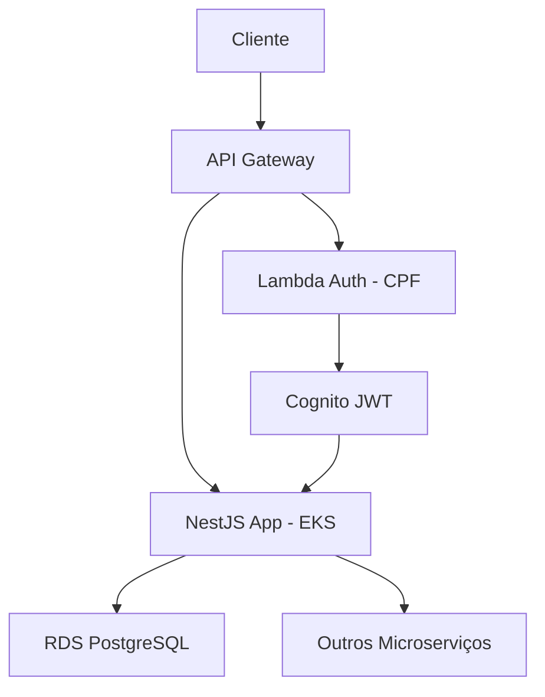

# 📋 FIAP SOAT - CONTEXTO COMPLETO DO PROJETO - FASE 3

## 🎯 **VISÃO GERAL DO PROJETO**

**Objetivo**: Migração e evolução do sistema FIAP SOAT da Fase 2 para arquitetura cloud-native na AWS usando microserviços, containers e serverless.

**Status**: ✅ **INFRAESTRUTURA PRONTA** | 🔄 **INTEGRAÇÃO EM ANDAMENTO**

---

## 🏗️ **ARQUITETURA COMPLETA**

### **4 Repositórios Principais:**

#### 1️⃣ **fiap-soat-k8s-terraform** (EKS + Infraestrutura)
- **Responsável**: Dev 3 (rs94458)  
- **Tecnologias**: Terraform, AWS EKS, Kubernetes, Docker
- **Status**: ✅ **PRONTO PARA PRODUÇÃO**

#### 2️⃣ **fiap-soat-application** (Aplicação NestJS)  
- **Responsável**: Dev 2 (thaismirandag)
- **Tecnologias**: NestJS, API Gateway, Cognito, JWT, Clean Architecture
- **Status**: 🔄 **EM MIGRAÇÃO DA FASE 2**

#### 3️⃣ **fiap-soat-database-terraform** (RDS PostgreSQL)
- **Responsável**: Dev 1 (MathLuchiari)  
- **Tecnologias**: Terraform, AWS RDS, PostgreSQL, VPC
- **Status**: ✅ **CONFIGURADO E OTIMIZADO**

#### 4️⃣ **fiap-soat-lambda** (Autenticação Serverless)
- **Responsável**: Dev 1 (MathLuchiari)
- **Tecnologias**: AWS Lambda, Node.js/TypeScript, JWT/Cognito  
- **Status**: 🔄 **EM DESENVOLVIMENTO**

---

## 🌐 **FLUXO DE INTEGRAÇÃO**



### **Fluxo de Autenticação:**
1. **Cliente** envia CPF via API Gateway
2. **Lambda** valida CPF e gera JWT via Cognito  
3. **NestJS App** recebe token e valida via guards
4. **Aplicação** acessa RDS PostgreSQL para operações

---

## 💰 **CONFIGURAÇÃO AWS ACADEMY**

### **Orçamento**: $50 USD total (CRÍTICO)
### **Região**: us-east-1 (obrigatório)

### **Custos Estimados:**
- **EKS Control Plane**: ~$73/mês ⚠️ (EXCEDE BUDGET!)
- **RDS PostgreSQL**: ~$15/mês (t3.micro)
- **EC2 Worker Nodes**: ~$15/mês (t3.micro)  
- **Lambda**: ~$0 (Free Tier)
- **API Gateway**: ~$3.50/milhão calls

### **⚠️ ESTRATÉGIA DE ECONOMIA:**
- ✅ **SEMPRE DESTRUIR** após demos/testes
- ✅ **Desenvolvimento local** com minikube/docker-compose
- ✅ **Deploy apenas para apresentação**

---

## 📁 **ESTRUTURA COMPLETA DOS REPOSITÓRIOS**

### **🔧 fiap-soat-k8s-terraform** (ATUAL - PRONTO)
```
environments/dev/       # Terraform EKS (DEPLOYADO ✅)
modules/eks/           # Cluster + Node Groups  
modules/vpc/           # Networking otimizado
manifests/application/ # K8s manifests prontos
scripts/              # Deploy/destroy automatizados
```

### **💻 fiap-soat-application** (EM MIGRAÇÃO)
```
src/modules/          # Clean Architecture (Fase 2)
├── auth/            # + Nova integração JWT/Cognito  
├── customers/       # Migração da Fase 2
├── products/        # Migração da Fase 2
├── orders/          # Migração da Fase 2
└── payments/        # Migração da Fase 2
config/              # + AWS services config
docker/              # Container para EKS
```

### **🗄️ fiap-soat-database-terraform** (CONFIGURADO)
```
modules/rds/         # PostgreSQL t3.micro
modules/vpc/         # VPC isolada
scripts/migrations/  # Database setup
```

### **⚡ fiap-soat-lambda** (EM DESENVOLVIMENTO)  
```
src/auth/handlers/   # CPF authentication
infrastructure/      # SAM/CloudFormation
tests/               # Unit + Integration
```

---

## 🚀 **STATUS ATUAL DE CADA REPOSITÓRIO**

### **✅ fiap-soat-k8s-terraform**: COMPLETAMENTE PRONTO
- ✅ Cluster EKS deployado e funcionando
- ✅ Aplicação de exemplo rodando (nginx)
- ✅ Load Balancer AWS configurado  
- ✅ Scripts de automação completos
- ✅ Manifests K8s estruturados
- ✅ Documentação completa

### **🔄 fiap-soat-application**: EM MIGRAÇÃO ATIVA
- ✅ Estrutura Clean Architecture (Fase 2)
- 🔄 Integração API Gateway + Cognito
- 🔄 Guards JWT + autenticação
- 🔄 Configuração Docker para EKS
- ❌ Build e deploy pipeline
- ❌ Integração com Lambda auth

### **✅ fiap-soat-database-terraform**: CONFIGURADO  
- ✅ Módulos Terraform prontos
- ✅ RDS PostgreSQL otimizado
- ✅ VPC e security groups
- ✅ Scripts de backup e migração
- ⚠️ Necessita deploy (custos)

### **🔄 fiap-soat-lambda**: EM DESENVOLVIMENTO INICIAL
- ✅ Estrutura SAM configurada  
- 🔄 Handler de autenticação CPF
- 🔄 Integração Cognito JWT
- ❌ Testes implementados
- ❌ Deploy pipeline

---

## 🔄 **PRÓXIMOS PASSOS POR REPOSITÓRIO**

### **fiap-soat-k8s-terraform** (LÍDER - 95% completo)
1. ✅ Manter cluster funcionando para demos
2. 🔄 Aguardar integração com aplicação real
3. 🔄 Configurar ingress controller se necessário

### **fiap-soat-application** (CRÍTICO - 60% completo)
1. 🚨 **PRIORIDADE 1**: Finalizar migração Fase 2 → NestJS
2. 🚨 **PRIORIDADE 2**: Implementar guards JWT/Cognito  
3. 🚨 **PRIORIDADE 3**: Build Docker + deploy EKS
4. 🔄 Integração com Lambda auth via API Gateway

### **fiap-soat-database-terraform** (AGUARDANDO - 90% completo)
1. 🔄 Deploy RDS quando aplicação estiver pronta
2. 🔄 Configurar connection strings
3. 🔄 Executar migrations iniciais

### **fiap-soat-lambda** (EM DESENVOLVIMENTO - 40% completo)  
1. 🔄 Implementar handler de autenticação CPF
2. 🔄 Configurar Cognito User Pool + JWT
3. 🔄 Testes unitários e integração
4. 🔄 Deploy SAM + API Gateway

---

## 📋 **DEPENDÊNCIAS ENTRE REPOSITÓRIOS**

### **Ordem de Deploy Recomendada:**
1. **fiap-soat-database-terraform** → RDS PostgreSQL
2. **fiap-soat-lambda** → Autenticação + Cognito  
3. **fiap-soat-application** → Build + push Docker
4. **fiap-soat-k8s-terraform** → Deploy app real no EKS

### **Integrações Necessárias:**
- **App → Database**: Connection strings RDS
- **App → Lambda**: API Gateway endpoints  
- **App → Cognito**: JWT validation keys
- **EKS → All**: Environment variables + secrets

---

## 🔐 **CONFIGURAÇÃO DE SECRETS (COMPARTILHADA)**

### **GitHub Organization Secrets** (já configurados):
```bash
AWS_ACCESS_KEY_ID        # AWS Academy credentials  
AWS_SECRET_ACCESS_KEY    # AWS Academy credentials
AWS_SESSION_TOKEN        # AWS Academy session
AWS_REGION=us-east-1     # Região fixa
TF_STATE_BUCKET          # S3 bucket para Terraform state
TF_STATE_LOCK_TABLE      # DynamoDB para locks
```

---

## 🎯 **CRONOGRAMA SUGERIDO FASE 3**

### **Semana 1-2**: Finalizar Aplicação
- **fiap-soat-application**: Completar migração + Docker
- **fiap-soat-lambda**: Implementar autenticação CPF

### **Semana 3**: Integração e Deploy  
- **Deploy database**: RDS PostgreSQL
- **Deploy lambda**: Autenticação + API Gateway
- **Build + Deploy**: App NestJS no EKS

### **Semana 4**: Testes e Documentação
- **Testes end-to-end**: Fluxo completo
- **Load testing**: Performance e escalabilidade  
- **Documentação final**: Demo e apresentação

---

## 🚨 **PONTOS DE ATENÇÃO**

### **CRÍTICOS:**
- ⚠️ **Budget AWS Academy**: EKS + RDS pode exceder $50
- ⚠️ **Credenciais temporárias**: Renovar AWS Academy
- ⚠️ **Dependências**: App precisa estar pronta para deploy

### **TÉCNICOS:**
- 🔧 **Clean Architecture**: Manter padrão da Fase 2
- 🔧 **JWT Integration**: Cognito + NestJS guards
- 🔧 **Database migrations**: PostgreSQL setup
- 🔧 **Container optimization**: Recursos limitados EKS

---

## 📞 **RESPONSABILIDADES E CONTATOS**

### **Dev 1 - MathLuchiari** (Database + Lambda)
- `fiap-soat-database-terraform` 
- `fiap-soat-lambda`
- **Foco**: RDS + Autenticação serverless

### **Dev 2 - thaismirandag** (Aplicação Principal)  
- `fiap-soat-application`
- **Foco**: NestJS + API Gateway + JWT

### **Dev 3 - rs94458** (Infraestrutura EKS) 
- `fiap-soat-k8s-terraform` ✅ **LÍDER ATUAL**
- **Foco**: EKS + Deploy + Integração final

---

**📌 Este documento deve ser atualizado sempre que houver mudanças significativas nos repositórios ou arquitetura.**

**🎯 Status geral**: 75% completo - **Infraestrutura pronta, aplicação em migração ativa**