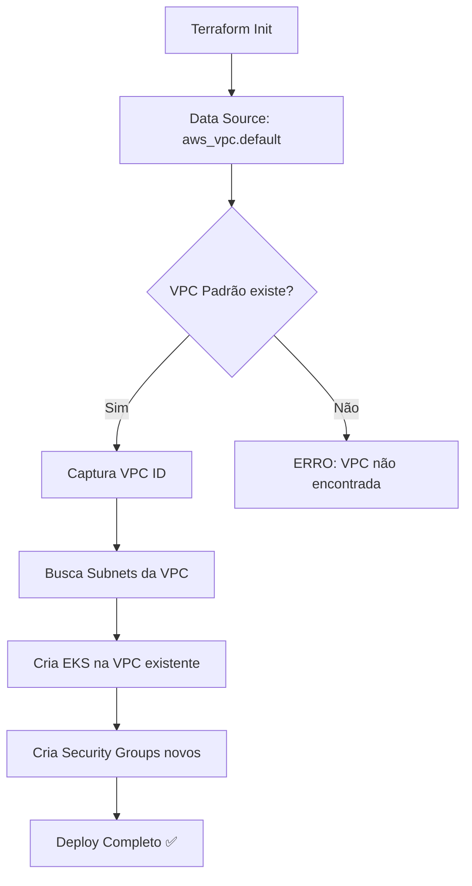

# ✅ Confirmação: VPC Auto-Discovery (Reutilização de Recursos)

## 🎯 Resumo Executivo

**SIM**, o EKS vai usar a **VPC já existente** na conta AWS Academy. Não criará uma nova VPC.

---

## 🔍 Comparação: RDS vs EKS

### 📊 Ambos usam a MESMA estratégia de VPC

| Repositório | Configuração | Comportamento |
|------------|--------------|---------------|
| **RDS** (database-terraform) | `data "aws_vpc" "default" { default = true }` | ✅ Busca VPC padrão existente |
| **EKS** (k8s-terraform) | `data "aws_vpc" "default" { default = true }` | ✅ Busca VPC padrão existente |

### 📝 Código Comparado

#### RDS: `/envs/dev/main.tf`
```hcl
data "aws_vpc" "default" {
  default = true
}

data "aws_subnets" "default" {
  filter {
    name   = "vpc-id"
    values = [data.aws_vpc.default.id]  # ← Usa VPC descoberta
  }
}
```

#### EKS: `/environments/dev/main.tf`
```hcl
data "aws_vpc" "default" {
  default = true
}

data "aws_subnets" "available" {
  filter {
    name   = "vpc-id"
    values = [data.aws_vpc.default.id]  # ← Usa VPC descoberta
  }
}
```

---

## 🏗️ O que Será CRIADO vs REUTILIZADO

### ♻️ Recursos REUTILIZADOS (Já existentes na conta)

| Recurso | Tipo | Como é descoberto |
|---------|------|-------------------|
| **VPC** | `data.aws_vpc.default` | Auto-discovery: `default = true` |
| **Subnets** | `data.aws_subnets.available` | Busca por `vpc-id` da VPC padrão |
| **IAM Roles** | `data.aws_iam_role.*` | Busca por nome: `LabEksClusterRole`, `LabEksNodeRole` |

### 🆕 Recursos que SERÃO CRIADOS (novos)

| Recurso | Motivo | Customização |
|---------|--------|--------------|
| **EKS Cluster** | Novo serviço | Nome: `fiap-soat-cluster` |
| **Security Groups** | Isolamento EKS | Cluster SG + Node SG (configurável) |
| **EKS Node Group** | Workers do K8s | t3.micro, 1-2 nodes |
| **Launch Template** | Config dos nodes | Metadados, monitoring |
| **EKS Add-ons** | CoreDNS, VPC-CNI, kube-proxy | Versões especificadas |

---

## 🔐 Security Groups: Opção de Reutilizar

### Comportamento Padrão (Atual)
```hcl
create_security_groups = true  # Cria novos SGs
```

### Opção: Reutilizar SGs Existentes
```hcl
create_security_groups     = false
cluster_security_group_id  = "sg-XXXXXXXXX"  # SG existente
node_security_group_id     = "sg-YYYYYYYYY"  # SG existente
```

**Recomendação**: Criar novos SGs para o EKS (já configurado assim por padrão).

---

## 📍 Fluxo de Descoberta da VPC



---

## 🧪 Como Validar?

### 1. Verificar VPC Existente (via AWS CLI)
```bash
aws ec2 describe-vpcs --filters "Name=isDefault,Values=true" --query 'Vpcs[0].[VpcId,CidrBlock,State]' --output table
```

**Saída esperada**:
```
---------------------------------------------
|              DescribeVpcs                |
+---------------------------+---------------+
|  vpc-0bc479b582e33b241   |  172.31.0.0/16|  available
+---------------------------+---------------+
```

### 2. Verificar Subnets da VPC
```bash
aws ec2 describe-subnets --filters "Name=vpc-id,Values=vpc-0bc479b582e33b241" --query 'Subnets[*].[SubnetId,AvailabilityZone,CidrBlock]' --output table
```

### 3. Terraform Plan (Mostra o que será feito)
```bash
cd environments/dev
terraform plan
```

**O que você verá**:
```hcl
# data.aws_vpc.default será lido (não criado)
data.aws_vpc.default: Reading...
data.aws_vpc.default: Read complete after 1s [id=vpc-0bc479b582e33b241]

# EKS Cluster será criado
+ resource "aws_eks_cluster" "main" {
    + name    = "fiap-soat-cluster"
    + vpc_id  = "vpc-0bc479b582e33b241"  # ← VPC existente!
    ...
  }
```

---

## ⚠️ Importante: AWS Academy

Na AWS Academy, a **VPC padrão é recriada** a cada nova sessão, mas com **ID diferente**!

### Problema (antes da refatoração)
```hcl
# ❌ Hardcoded - quebrava a cada nova sessão
vpc_id = "vpc-0f8b460d4c712bc5f"
```

### Solução (implementada agora)
```hcl
# ✅ Auto-discovery - funciona sempre
data "aws_vpc" "default" {
  default = true
}
```

---

## 🎯 Conclusão

### ✅ Confirmações

1. **VPC**: ♻️ **REUTILIZADA** (auto-discovery da VPC padrão)
2. **Subnets**: ♻️ **REUTILIZADAS** (busca automática na VPC)
3. **IAM Roles**: ♻️ **REUTILIZADAS** (LabEksClusterRole, LabEksNodeRole)
4. **Security Groups**: 🆕 **CRIADOS** (isolamento do EKS)
5. **EKS Cluster**: 🆕 **CRIADO** (novo serviço)
6. **Node Groups**: 🆕 **CRIADOS** (workers do Kubernetes)

### 📊 Impacto de Custos

| Recurso | Status | Custo |
|---------|--------|-------|
| VPC (existente) | Reutilizada | $0 |
| Subnets (existentes) | Reutilizadas | $0 |
| Security Groups | Criados novos | $0 (SGs são gratuitos) |
| EKS Cluster | Criado | ~$0.10/hora |
| EC2 t3.micro (2x) | Criados | ~$0.0104/hora cada |
| **Total estimado** | | **~$0.12/hora** |

---

## 🚀 Próximos Passos

1. ✅ Renovar credenciais AWS Academy (expiraram)
2. ✅ Executar `terraform plan` para confirmar
3. ✅ Verificar que VPC ID será descoberto automaticamente
4. ✅ Fazer `terraform apply` para criar EKS na VPC existente

---

**Última atualização**: 2025-10-05  
**Status**: ✅ Configuração validada e pronta para deploy
