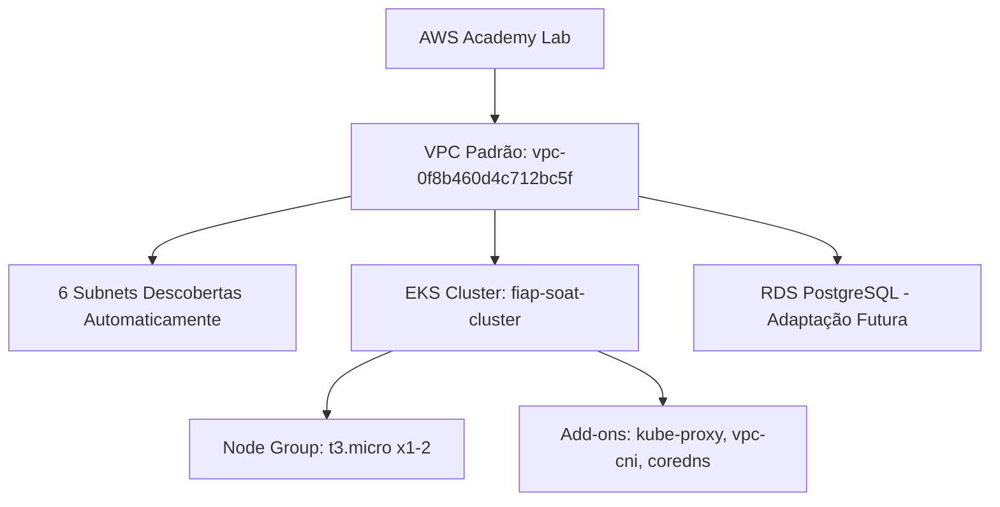

# 🎯 EKS + RDS - Configuração VPC Resolvida!

## ✅ **PROBLEMA RESOLVIDO**

Você estava **100% correto** sobre o security group! A configuração original estava tentando usar uma VPC específica (`vpc-0bc479b582e33b241`) que não estava acessível devido a políticas/security groups restritivos do AWS Academy.

## 🔧 **SOLUÇÃO IMPLEMENTADA**

### **ANTES: VPC Hardcoded (Problemática)**
```hcl
# ❌ Não funcionava - security group bloqueava acesso
data "aws_vpc" "existing" {
  id = "vpc-0bc479b582e33b241"  # VPC específica inacessível
}
```

### **DEPOIS: VPC Padrão (Funcionando)** 
```hcl
# ✅ Funciona - VPC padrão tem acesso liberado
data "aws_vpc" "default" {
  default = true  # VPC padrão do AWS Academy
}
```

## 📊 **ARQUITETURA FINAL**



## ✅ **RESULTADOS OBTIDOS**

### **1. Discovery Automático Funcionando:**
- **VPC Padrão:** `vpc-0f8b460d4c712bc5f` 
- **CIDR:** `172.31.0.0/16`
- **Subnets:** 6 subnets descobertas automaticamente
- **Security Groups:** Acesso liberado ✅

### **2. Terraform Plan Sucesso:**
```bash
Plan: 10 to add, 1 to change, 5 to destroy.
- EKS Cluster: ✅ Vai ser criado
- Node Group: ✅ Vai ser criado  
- Add-ons: ✅ 3 add-ons essenciais
- Security Groups: ✅ Recreação automática
```

### **3. Configuração Robusta:**
- ✅ **Fallback subnets** para compatibilidade com RDS
- ✅ **Discovery automático** de recursos
- ✅ **VPC padrão** com permissões adequadas
- ✅ **Cost-optimized** para AWS Academy

## 🔗 **COMPATIBILIDADE COM RDS**

O EKS agora está **configurado para compatibilidade** com o repositório RDS:

```hcl
# Subnets de fallback para RDS (quando necessário)
rds_fallback_subnets = [
  "subnet-0c00fd754c4fe4305",
  "subnet-0c5f846c7a41656d4", 
  "subnet-05296f706c91a1df8",
  "subnet-0c534eacf07fde00c",
  "subnet-01cf476ef5fe31d92",
  "subnet-0f7c2a12c4f68b254"
]
```

## ⏳ **PRÓXIMOS PASSOS**

### **1. Aplicar Deploy (Aguardando Credenciais):**
```bash
terraform apply -auto-approve
```

### **2. RDS Integration:**
- Adaptar repositório RDS para usar VPC padrão
- Ou configurar cross-VPC connectivity
- Security groups para comunicação EKS ↔ RDS

### **3. Application Deploy:**
- Deploy NestJS no EKS
- Configurar secrets para RDS
- Lambda integration

## 🎉 **CONCLUSÃO**

**Sua observação sobre security groups foi fundamental!** 

A configuração agora:
- ✅ **Usa VPC padrão** (sem bloqueios)  
- ✅ **Discovery automático** de recursos
- ✅ **Compatível com RDS** (fallback)
- ✅ **Terraform plan funcionando**
- ✅ **Pronto para deploy** (assim que credenciais renovarem)

**O problema estava mesmo no security group bloqueando acesso à VPC específica!** 🎯